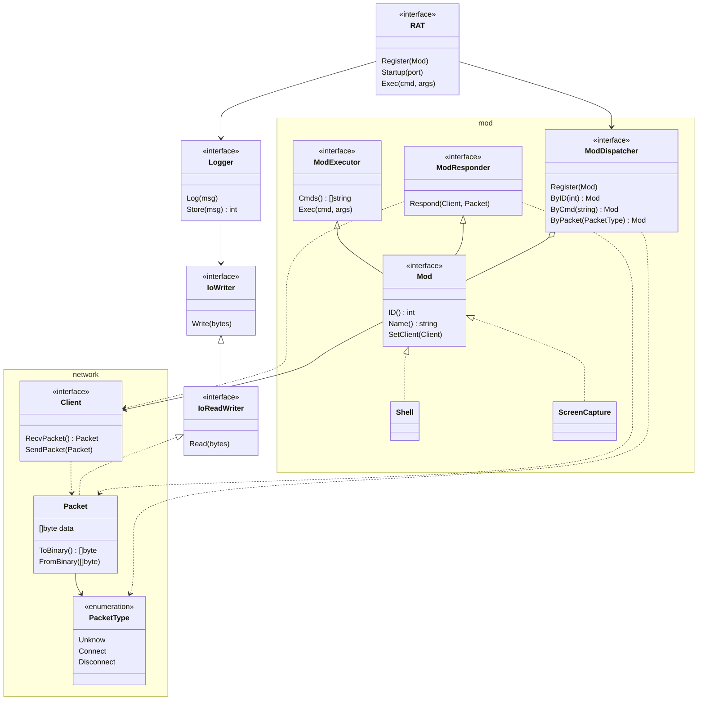

# *Goasm* RAT

[](https://golang.org)

[](https://www.microsoft.com/en-ie/windows)


## 翻译

- [English](https://github.com/Zhuagenborn/Goasm-RAT/blob/master/README.md)
- [简体中文](https://github.com/Zhuagenborn/Goasm-RAT/blob/master/README-CN.md)

## 简介


***Goasm-RAT***是一款简单的**Windows**控制台远程控制工具，使用*Go*和*Intel x86 Assembly*编写，支持远程Shell及屏幕截图。

## 开始

### 前置条件

- 安装[*MASM32*](http://www.masm32.com)。
- 安装[*Go*](https://golang.org)。

### 构建

#### 客户端

```console
..\client> .\build.ps1
```

#### 服务器

```console
..\server\scripts> .\build.ps1
```

## 使用

### 客户端

使用命令行参数指定服务器的*IPv4*地址及*TCP*端口号。

```console
client <ipv4-addr> <port>
```

### 服务器

使用`-p`选项指定*TCP*监听端口，默认端口为**10080**。

```console
server -p <port>
```

使用`-h`选项显示帮助信息。

```console
-h    This help
-p int
      Listening port (default 10080)
```

#### 命令

当服务器等待用户输入时，后台信息和命令执行结果并不会实时显示，需要使用<kbd>Enter</kbd>手动刷新。

##### 基础控制

- ```console
  sw <client-id>
  ```

  切换当前控制的客户端。

  ```console
  > sw 1
  Sep 24 23:03:27: The current client has changed to [1].
  ```

- ```console
  exit
  ```

  退出服务器。

##### Shell

```console
exec <command>
```

在客户端执行Shell命令。

```console
> exec whoami
>
Sep 25 00:21:38: Shell messages from the client [1]:
----------------------------------------------------
whoami
desktop-testpc1\chenzs

C:\Users\chenzs\Goasm-RAT\client>
----------------------------------------------------
```

##### 屏幕截图

```console
sc
```

截取客户端屏幕，保存为`.png`文件。

## 类图



## Bugs

已知的Bug在代码注释中使用`BUG`标记。

## 许可证

使用*MIT*协议，请参考`LICENSE`文件。