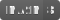

# *Goasm* RAT

[](https://golang.org)

[](https://www.microsoft.com/en-ie/windows)


## Languages

- [English](https://github.com/Zhuagenborn/Goasm-RAT/blob/master/README.md)
- [简体中文](https://github.com/Zhuagenborn/Goasm-RAT/blob/master/README-CN.md)

## Introduction


***Goasm-RAT*** is a simple **Windows** console remote administration tool, written in *Go* and *Intel x86 Assembly*. It supports remote shell and screenshot.

## Getting Started

### Prerequisites

- Install [*MASM32*](http://www.masm32.com).
- Install [*Go*](https://golang.org).

### Building

#### Client

```console
..\client> .\build.ps1
```

#### Server

```console
..\server\scripts> .\build.ps1
```

## Usage

### Client

Use command line arguments to specify the *IPv4* address and *TCP* port of the server when running the client.

```console
client <ipv4-addr> <port>
```

### Server

Use `-p` option to specify the *TCP* listening port, the default port is **10080**.

```console
server -p <port>
```

Use `-h` option to print the help.

```console
-h    This help
-p int
      Listening port (default 10080)
```

#### Commands

When the server is waiting for user input, the background information or execution results will not be displayed in real-time. You need to press <kbd>Enter</kbd> to flush manually.

##### Basic Control

- ```console
  sw <client-id>
  ```

  Switch the client currently being controlled.

  ```console
  > sw 1
  Sep 24 23:03:27: The current client has changed to [1].
  ```

- ```console
  exit
  ```

  Exit the server.

##### Shell

```console
exec <command>
```

Execute a shell command on the client.

```console
> exec whoami
>
Sep 25 00:21:38: Shell messages from the client [1]:
----------------------------------------------------
whoami
desktop-testpc1\chenzs

C:\Users\chenzs\Goasm-RAT\client>
----------------------------------------------------
```

##### Screenshot

```console
sc
```

Take a screenshot of the client and save it as a `.png` file.

## Class Diagram


## Bugs

The known bugs are marked by `BUG` in the comments.

## License

Distributed under the *MIT License*. See `LICENSE` for more information.